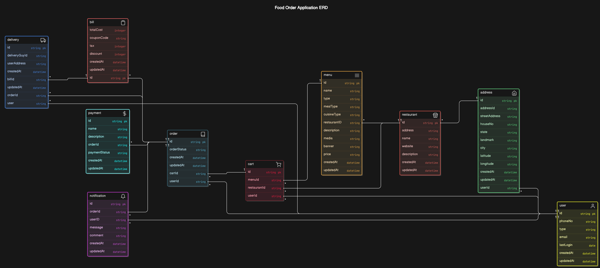

# Food Order Backend Application

A RESTful backend service for managing food orders, handling customer data, menu items, and processing orders for a food delivery application. This service is built to integrate with a frontend to provide a complete ordering experience.

## Table of Contents
- [Entity-Relationship-Model](#Entity-Relationship-Model)
- [Features](#features)
- [Tech Stack](#tech-stack)
- [Installation](#installation)
- [Configuration](#configuration)
- [API Endpoints](#api-endpoints)
- [Usage](#usage)
- [Contributing](#contributing)
- [License](#license)

## Entity-Relationship-Model

## Features

- **User Authentication**: Register, login, and secure user sessions.
- **Menu Management**: Add, update, and retrieve menu items.
- **Order Management**: Place, update, and track orders.
- **Admin Access**: Admins can manage users, orders, and menu items.
- **Payment Integration**: Supports payment processing.
- **Live Order Tracking**: Real-time tracking of orders, allowing customers to follow their order status and delivery progress.
- **Location-Based Restaurants**: Filter and display restaurants based on the user's current location to provide a personalized list of nearby restaurants.
- **Push Notifications**: Send notifications to customers for order confirmation, preparation updates, and delivery status.
- **Favorites**: Allow users to mark certain restaurants or menu items as favorites for easy access in the future.
- **Order History**: Track past orders for each user, with the ability to reorder previous meals quickly.
- **Ratings and Reviews**: Users can leave ratings and reviews for restaurants and dishes, helping improve quality and transparency.
- **Discounts and Promotions**: Apply promotional discounts or offer seasonal deals, which can be managed through an admin panel.
- **Multi-language Support**: Offer language options to cater to diverse user groups.
  
## Tech Stack

- **Node.js** - Server environment
- **Express** - Web framework for Node.js
- **MongoDB** - NoSQL database for storing data
- **JWT** - JSON Web Tokens for authentication
- **Bcrypt** - For password hashing
- **dotenv** - Environment configuration

## Installation

1. **Clone the repository**:
   ```bash
   git clone https://github.com/Sarvesh207/food_order_backend
   cd food-order-backend
